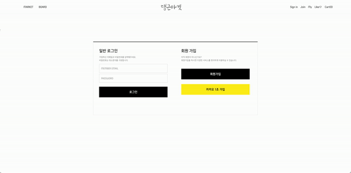
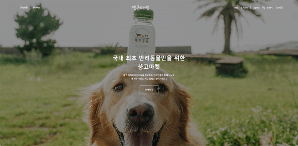
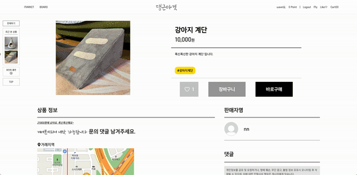
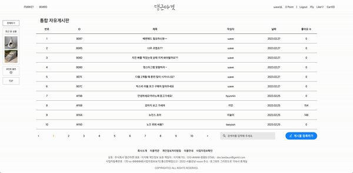
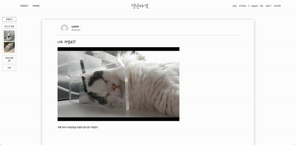
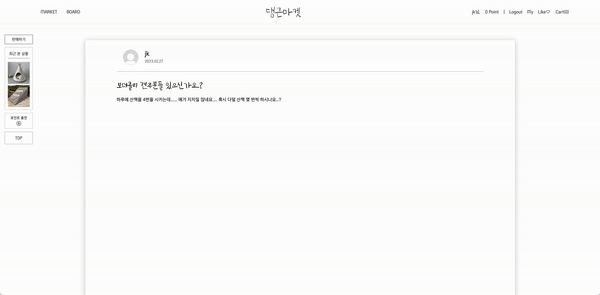
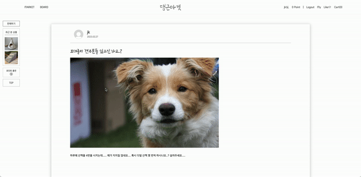
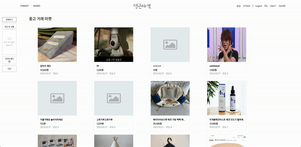
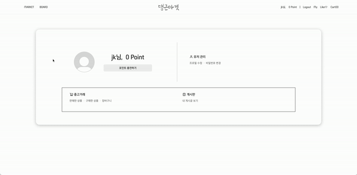
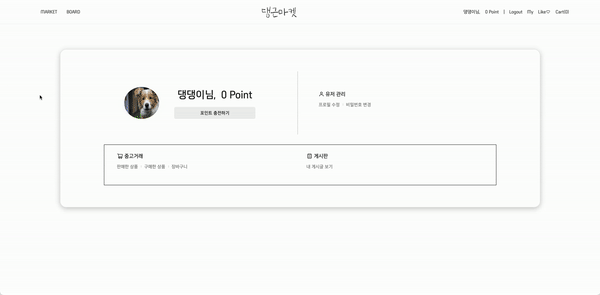

# 🐶 danggn-market

<div align="center">
  
</div>

<div align="center">
  <a href="https://danggn.shop/">🔗 서비스</a> &nbsp;&nbsp;&nbsp;&nbsp;&nbsp;
  <a href="https://github.com/leedawnn/danggn-market/wiki">🔗 Wiki</a>
</div>

<br />

> 오직 반려동물만을 위한 커뮤니티 겸 중고거래 서비스, **댕근마켓**

댕근마켓은 누구나 반려동물을 키우는 집사라면 편리하게 이용할 수 있는 웹 기반 서비스입니다.  
반려동물 육아에 있어 필요한 상품들을 댕근마켓에서 찾을 수 있습니다.  
중고 거래부터 정보 공유까지 반려인들과 함께해요 🐶💛

## ⚙️ 사용 기술 스택

- Typescript
- Next.js
- Emotion
- Recoil
- GraphQL

## 🔧 실행 방법(Getting Started)

step1) 댕근마켓 레포를 클론합니다.

```terminal
$ git clone https://github.com/leedawnn/danggn-market.git
```

step2) 클론한 폴더로 이동하여 패키지를 설치합니다.

```terminal
$ yarn install
$ yarn dev
```

## 🐾 시연 영상

| 기능                        | 스크린샷                                                                  |
| --------------------------- | ------------------------------------------------------------------------- |
| 랜딩 페이지                 |                       |
| 회원가입                    |                             |
| 로그인                      |                              |
| 로그아웃                    |                           |
| 중고마켓 리스트             |               |
| 중고마켓 상품 등록          |          |
| 중고마켓 상세 페이지        |        |
| 중고마켓 상품 댓글          |         |
| 커뮤니티 리스트             |                |
| 커뮤니티 게시글 등록        |         |
| 커뮤니티 게시글 상세 페이지 |  |
| 커뮤니티 게시글 수정        |           |
| 커뮤니티 게시글 삭제        |         |
| 사이드바                    |                          |
| 마이 페이지 - 프로필 수정   |                  |
| 포인트 충전                 |                  |
| 포인트 결제                 |                     |
| 404 페이지                  |                            |
